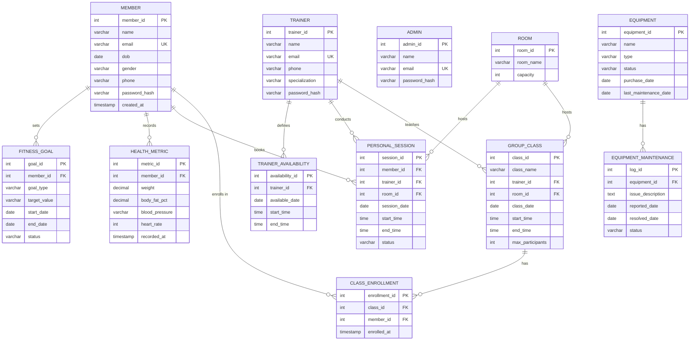

# Health and Fitness Club Management System — ER Diagram

## Entity-Relationship Model

This document describes the conceptual ER model for the Health and Fitness Club Management System. The diagram below uses UML-like notation and can be rendered with any Mermaid-compatible tool.

## ER Diagram (Mermaid)

## Entities (12)

| # | Entity | Description |
|---|--------|-------------|
| 1 | Member | Registered club members who book sessions and track health |
| 2 | Trainer | Fitness trainers who conduct sessions and classes |
| 3 | Admin | Administrative staff managing rooms, equipment, and billing |
| 4 | FitnessGoal | Goals set by members (weight loss, strength, etc.) |
| 5 | HealthMetric | Append-only health measurements recorded by members |
| 6 | TrainerAvailability | Time slots when trainers are available |
| 7 | Room | Physical rooms in the fitness club |
| 8 | Equipment | Gym equipment tracked for maintenance |
| 9 | PersonalSession | One-on-one training sessions between a member and trainer |
| 10 | GroupClass | Group fitness classes taught by a trainer |
| 11 | ClassEnrollment | Junction entity for the many-to-many between Member and GroupClass |
| 12 | EquipmentMaintenance | Maintenance logs for equipment |

## Relationships (11)

| # | Relationship | Cardinality | Description |
|---|-------------|-------------|-------------|
| 1 | Member sets FitnessGoal | 1:N | A member can have many fitness goals |
| 2 | Member records HealthMetric | 1:N | A member records many health metrics over time |
| 3 | Member books PersonalSession | 1:N | A member can book many personal sessions |
| 4 | Member enrolls in ClassEnrollment | 1:N | A member can enroll in many classes |
| 5 | Trainer defines TrainerAvailability | 1:N | A trainer sets many availability slots |
| 6 | Trainer conducts PersonalSession | 1:N | A trainer can conduct many personal sessions |
| 7 | Trainer teaches GroupClass | 1:N | A trainer can teach many group classes |
| 8 | Room hosts PersonalSession | 1:N | A room can host many personal sessions |
| 9 | Room hosts GroupClass | 1:N | A room can host many group classes |
| 10 | GroupClass has ClassEnrollment | 1:N | A group class has many enrollments |
| 11 | Equipment has EquipmentMaintenance | 1:N | Equipment can have many maintenance logs |

## Participation Constraints

- Every FitnessGoal must belong to exactly one Member (total participation)
- Every HealthMetric must belong to exactly one Member (total participation)
- Every PersonalSession must have exactly one Member, one Trainer, and one Room (total participation)
- Every GroupClass must have exactly one Trainer and one Room (total participation)
- Every ClassEnrollment must reference exactly one GroupClass and one Member (total participation)
- Every EquipmentMaintenance must reference exactly one Equipment (total participation)
- A Member may have zero or more FitnessGoals, HealthMetrics, PersonalSessions, ClassEnrollments (partial participation)
- A Trainer may have zero or more Availability slots, PersonalSessions, GroupClasses (partial participation)
