# Health and Fitness Club Management System — Relational Schema

## Mapping from ER Model to Relational Schema

Each entity in the ER model maps directly to a relation (table). The many-to-many relationship between Member and GroupClass is resolved via the ClassEnrollment junction table.

## Relational Schema Diagram (Mermaid)

```mermaid
erDiagram
    member {
        SERIAL member_id PK
        VARCHAR_100 name "NOT NULL"
        VARCHAR_150 email "UNIQUE NOT NULL"
        DATE dob "NOT NULL"
        VARCHAR_10 gender "CHECK male female other"
        VARCHAR_20 phone
        VARCHAR_255 password_hash "NOT NULL"
        TIMESTAMP created_at "DEFAULT NOW()"
    }

    trainer {
        SERIAL trainer_id PK
        VARCHAR_100 name "NOT NULL"
        VARCHAR_150 email "UNIQUE NOT NULL"
        VARCHAR_20 phone
        VARCHAR_100 specialization
        VARCHAR_255 password_hash "NOT NULL"
    }

    admin {
        SERIAL admin_id PK
        VARCHAR_100 name "NOT NULL"
        VARCHAR_150 email "UNIQUE NOT NULL"
        VARCHAR_20 phone
        VARCHAR_255 password_hash "NOT NULL"
    }

    fitness_goal {
        SERIAL goal_id PK
        INT member_id FK "NOT NULL REFERENCES member"
        VARCHAR_50 goal_type "NOT NULL"
        VARCHAR_100 target_value "NOT NULL"
        DATE start_date "NOT NULL"
        DATE end_date
        VARCHAR_20 status "CHECK active completed cancelled"
    }

    health_metric {
        SERIAL metric_id PK
        INT member_id FK "NOT NULL REFERENCES member"
        DECIMAL weight
        DECIMAL body_fat_pct
        VARCHAR_20 blood_pressure
        INT heart_rate
        TIMESTAMP recorded_at "DEFAULT NOW()"
    }

    trainer_availability {
        SERIAL availability_id PK
        INT trainer_id FK "NOT NULL REFERENCES trainer"
        DATE available_date "NOT NULL"
        TIME start_time "NOT NULL"
        TIME end_time "NOT NULL"
    }

    room {
        SERIAL room_id PK
        VARCHAR_100 room_name "NOT NULL UNIQUE"
        INT capacity "NOT NULL CHECK > 0"
    }

    equipment {
        SERIAL equipment_id PK
        VARCHAR_100 name "NOT NULL"
        VARCHAR_50 type "NOT NULL"
        INT room_id FK "NOT NULL REFERENCES room"
        VARCHAR_20 status "CHECK operational under_repair out_of_service"
        DATE purchase_date
    }

    personal_session {
        SERIAL session_id PK
        INT member_id FK "NOT NULL REFERENCES member"
        INT trainer_id FK "NOT NULL REFERENCES trainer"
        INT room_id FK "NOT NULL REFERENCES room"
        DATE session_date "NOT NULL"
        TIME start_time "NOT NULL"
        TIME end_time "NOT NULL"
        VARCHAR_20 status "CHECK scheduled completed cancelled"
    }

    group_class {
        SERIAL class_id PK
        VARCHAR_100 class_name "NOT NULL"
        INT trainer_id FK "NOT NULL REFERENCES trainer"
        INT room_id FK "NOT NULL REFERENCES room"
        DATE class_date "NOT NULL"
        TIME start_time "NOT NULL"
        TIME end_time "NOT NULL"
        INT max_participants "NOT NULL CHECK > 0"
    }

    class_enrollment {
        SERIAL enrollment_id PK
        INT class_id FK "NOT NULL REFERENCES group_class"
        INT member_id FK "NOT NULL REFERENCES member"
        TIMESTAMP enrolled_at "DEFAULT NOW()"
    }

    equipment_maintenance {
        SERIAL log_id PK
        INT equipment_id FK "NOT NULL REFERENCES equipment"
        TEXT issue_description "NOT NULL"
        DATE reported_date "NOT NULL DEFAULT CURRENT_DATE"
        DATE resolved_date
        VARCHAR_20 status "CHECK reported in_progress resolved"
    }

    payment {
        SERIAL payment_id PK
        INT member_id FK "NOT NULL REFERENCES member"
        DECIMAL amount "NOT NULL CHECK >= 0"
        VARCHAR_20 payment_status "CHECK pending completed failed refunded"
        DATE payment_date "NOT NULL DEFAULT CURRENT_DATE"
        VARCHAR_50 payment_method
    }

    member ||--o{ fitness_goal : "member_id"
    member ||--o{ health_metric : "member_id"
    member ||--o{ personal_session : "member_id"
    member ||--o{ class_enrollment : "member_id"
    trainer ||--o{ trainer_availability : "trainer_id"
    trainer ||--o{ personal_session : "trainer_id"
    trainer ||--o{ group_class : "trainer_id"
    room ||--o{ personal_session : "room_id"
    room ||--o{ group_class : "room_id"
    room ||--o{ equipment : "room_id"
    group_class ||--o{ class_enrollment : "class_id"
    equipment ||--o{ equipment_maintenance : "equipment_id"
    member ||--o{ payment : "member_id"
```

## Table Definitions

### member
| Column | Type | Constraints |
|--------|------|-------------|
| member_id | SERIAL | PRIMARY KEY |
| name | VARCHAR(100) | NOT NULL |
| email | VARCHAR(150) | UNIQUE, NOT NULL |
| dob | DATE | NOT NULL |
| gender | VARCHAR(10) | CHECK (gender IN ('male', 'female', 'other')) |
| phone | VARCHAR(20) | |
| password_hash | VARCHAR(255) | NOT NULL |
| created_at | TIMESTAMP | DEFAULT NOW() |

### trainer
| Column | Type | Constraints |
|--------|------|-------------|
| trainer_id | SERIAL | PRIMARY KEY |
| name | VARCHAR(100) | NOT NULL |
| email | VARCHAR(150) | UNIQUE, NOT NULL |
| phone | VARCHAR(20) | |
| specialization | VARCHAR(100) | |
| password_hash | VARCHAR(255) | NOT NULL |

### admin
| Column | Type | Constraints |
|--------|------|-------------|
| admin_id | SERIAL | PRIMARY KEY |
| name | VARCHAR(100) | NOT NULL |
| email | VARCHAR(150) | UNIQUE, NOT NULL |
| phone | VARCHAR(20) | |
| password_hash | VARCHAR(255) | NOT NULL |

### fitness_goal
| Column | Type | Constraints |
|--------|------|-------------|
| goal_id | SERIAL | PRIMARY KEY |
| member_id | INTEGER | NOT NULL, FK -> member(member_id) ON DELETE CASCADE |
| goal_type | VARCHAR(50) | NOT NULL |
| target_value | VARCHAR(100) | NOT NULL |
| start_date | DATE | NOT NULL |
| end_date | DATE | |
| status | VARCHAR(20) | CHECK (status IN ('active', 'completed', 'cancelled')), DEFAULT 'active' |

### health_metric
| Column | Type | Constraints |
|--------|------|-------------|
| metric_id | SERIAL | PRIMARY KEY |
| member_id | INTEGER | NOT NULL, FK -> member(member_id) ON DELETE CASCADE |
| weight | DECIMAL(5,2) | |
| body_fat_pct | DECIMAL(5,2) | |
| blood_pressure | VARCHAR(20) | |
| heart_rate | INTEGER | |
| recorded_at | TIMESTAMP | DEFAULT NOW() |

### trainer_availability
| Column | Type | Constraints |
|--------|------|-------------|
| availability_id | SERIAL | PRIMARY KEY |
| trainer_id | INTEGER | NOT NULL, FK -> trainer(trainer_id) ON DELETE CASCADE |
| available_date | DATE | NOT NULL |
| start_time | TIME | NOT NULL |
| end_time | TIME | NOT NULL |
| | | CHECK (end_time > start_time) |

### room
| Column | Type | Constraints |
|--------|------|-------------|
| room_id | SERIAL | PRIMARY KEY |
| room_name | VARCHAR(100) | NOT NULL, UNIQUE |
| capacity | INTEGER | NOT NULL, CHECK (capacity > 0) |

### equipment
| Column | Type | Constraints |
|--------|------|-------------|
| equipment_id | SERIAL | PRIMARY KEY |
| name | VARCHAR(100) | NOT NULL |
| type | VARCHAR(50) | NOT NULL |
| room_id | INTEGER | NOT NULL, FK -> room(room_id) ON DELETE RESTRICT |
| status | VARCHAR(20) | CHECK (status IN ('operational', 'under_repair', 'out_of_service')), DEFAULT 'operational' |
| purchase_date | DATE | |

### personal_session
| Column | Type | Constraints |
|--------|------|-------------|
| session_id | SERIAL | PRIMARY KEY |
| member_id | INTEGER | NOT NULL, FK -> member(member_id) ON DELETE CASCADE |
| trainer_id | INTEGER | NOT NULL, FK -> trainer(trainer_id) ON DELETE CASCADE |
| room_id | INTEGER | NOT NULL, FK -> room(room_id) ON DELETE CASCADE |
| session_date | DATE | NOT NULL |
| start_time | TIME | NOT NULL |
| end_time | TIME | NOT NULL |
| status | VARCHAR(20) | CHECK (status IN ('scheduled', 'completed', 'cancelled')), DEFAULT 'scheduled' |
| | | CHECK (end_time > start_time) |

### group_class
| Column | Type | Constraints |
|--------|------|-------------|
| class_id | SERIAL | PRIMARY KEY |
| class_name | VARCHAR(100) | NOT NULL |
| trainer_id | INTEGER | NOT NULL, FK -> trainer(trainer_id) ON DELETE CASCADE |
| room_id | INTEGER | NOT NULL, FK -> room(room_id) ON DELETE CASCADE |
| class_date | DATE | NOT NULL |
| start_time | TIME | NOT NULL |
| end_time | TIME | NOT NULL |
| max_participants | INTEGER | NOT NULL, CHECK (max_participants > 0) |
| | | CHECK (end_time > start_time) |

### class_enrollment
| Column | Type | Constraints |
|--------|------|-------------|
| enrollment_id | SERIAL | PRIMARY KEY |
| class_id | INTEGER | NOT NULL, FK -> group_class(class_id) ON DELETE CASCADE |
| member_id | INTEGER | NOT NULL, FK -> member(member_id) ON DELETE CASCADE |
| enrolled_at | TIMESTAMP | DEFAULT NOW() |
| | | UNIQUE (class_id, member_id) |

### equipment_maintenance
| Column | Type | Constraints |
|--------|------|-------------|
| log_id | SERIAL | PRIMARY KEY |
| equipment_id | INTEGER | NOT NULL, FK -> equipment(equipment_id) ON DELETE CASCADE |
| issue_description | TEXT | NOT NULL |
| reported_date | DATE | NOT NULL, DEFAULT CURRENT_DATE |
| resolved_date | DATE | |
| status | VARCHAR(20) | CHECK (status IN ('reported', 'in_progress', 'resolved')), DEFAULT 'reported' |

### payment
| Column | Type | Constraints |
|--------|------|-------------|
| payment_id | SERIAL | PRIMARY KEY |
| member_id | INTEGER | NOT NULL, FK -> member(member_id) ON DELETE CASCADE |
| amount | DECIMAL(10,2) | NOT NULL, CHECK (amount >= 0) |
| payment_status | VARCHAR(20) | CHECK (payment_status IN ('pending', 'completed', 'failed', 'refunded')), DEFAULT 'pending' |
| payment_date | DATE | NOT NULL, DEFAULT CURRENT_DATE |
| payment_method | VARCHAR(50) | |

## Normalization to 3NF

### First Normal Form (1NF)
All attributes are atomic. No repeating groups or multi-valued attributes exist. Each table has a defined primary key.

### Second Normal Form (2NF)
All non-key attributes are fully functionally dependent on the entire primary key. Since all tables use a single-column surrogate primary key (SERIAL), there are no partial dependencies. The one composite candidate key (class_id, member_id) in class_enrollment is enforced via UNIQUE but the primary key is a surrogate.

### Third Normal Form (3NF)
No transitive dependencies exist:
- **member**: name, email, dob, gender, phone, password_hash, created_at all depend directly on member_id
- **fitness_goal**: goal attributes depend on goal_id; member_id is a foreign key, not a transitive dependency
- **health_metric**: metric values depend on metric_id; member_id is a foreign key
- **equipment**: name, type, room_id, status, purchase_date all depend directly on equipment_id; room_id is a foreign key; status is the *current* status, not derivable from maintenance logs (which track history)
- **equipment_maintenance**: maintenance details depend on log_id; equipment_id is a foreign key
- No derived/computed attributes are stored (e.g., age is not stored — computed from dob; total classes attended is computed via COUNT query)

### Justification for Separate Tables
- **HealthMetric** is separated from Member because health metrics are append-only time-series data (1:N)
- **FitnessGoal** is separated from Member because a member can have multiple concurrent goals (1:N)
- **EquipmentMaintenance** is separated from Equipment to track maintenance history (1:N)
- **ClassEnrollment** resolves the M:N relationship between Member and GroupClass
- **TrainerAvailability** is separated from Trainer because availability changes over time (1:N)
